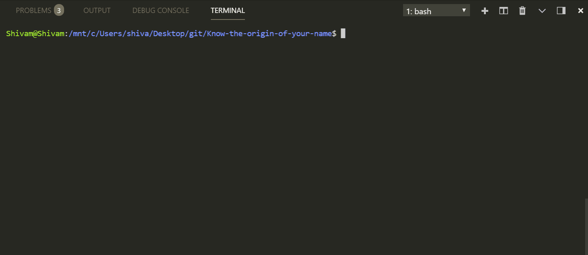

# Know-the-origin-of-your-name
A simple RNN which predicts the origin of your name!  

### The model learnt the naming symantics of different languages quite well!
#### Donald and Toyota were present in the training data and were predicted correctly.
#### Ronaldo, Hitler and KimJong were not present in the training data and the model yet predicted their correct origin!
#### The training data consist of 18 files of different languages.
Feel free to train model on other language names. You may perhaps want to train it with Indian names! 
Note that the model performs poorly in English because of overlapping of names in many other languages eg Jane.
Increasing training data and using LSTM cells instead of vanilla RNN will increase performance.
